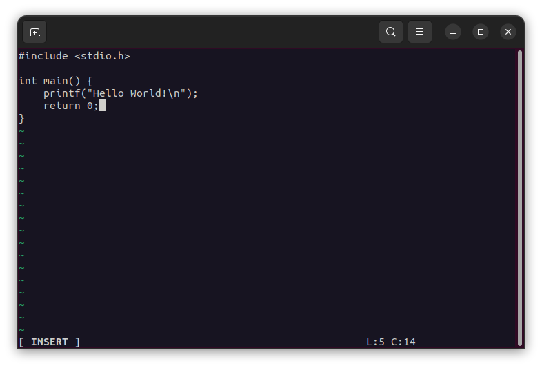

# **Sim** #
### SIMple Text Editor

**Sim** is a terminal-based text editor that immitates some of the *bare bones* text editing features of [*Vim*](https://github.com/vim/vim). 

Written in the **C language** using the **ncurses** library for the TUI. 

&nbsp;

# **Installation** #
1. Clone the repository to your local machine
```console
$ git clone [link]
```

2. Enter the repository directory
```console
$ cd /.../sim
```

3. Compile the source code via. make
```console
$ make clean && make
```

4. Run
```console
$ cd bin && ./main
```
&nbsp;

# **Usage** #
Refer to the help message of the program
```console
$ ./main -h
```

&nbsp;

### Hello World! ##

